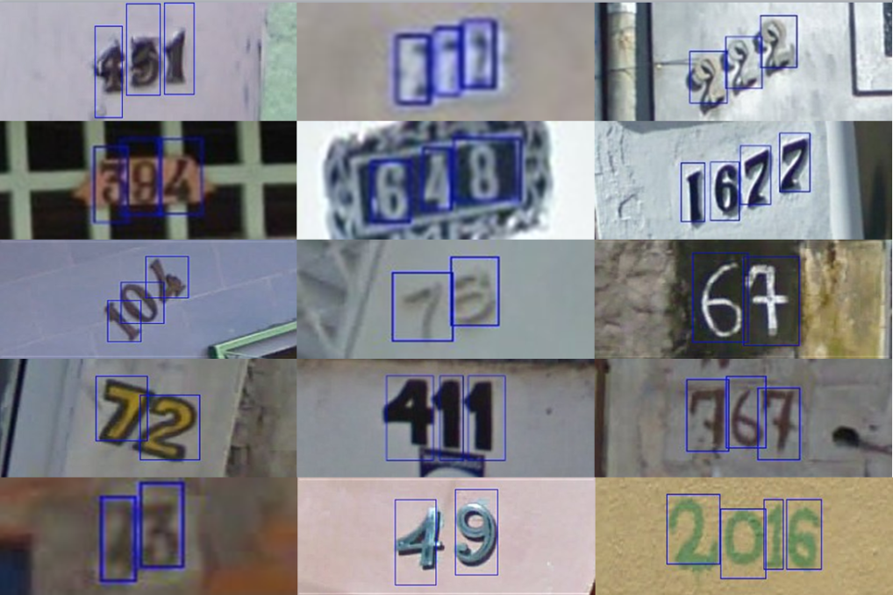

# House Number Recognition demo (w/ Google Street View)

The project serves as an introductory lesson to working with digit recognition problems using `sk-learn` and images from the [SVHN Dataset](http://ufldl.stanford.edu/housenumbers/).

The app is built with Flask, the model is pre-trained with a `sklearn.ensemble.RandomForestClassifer` class object.

This project is completely educational and all image assets belong to their respective owner.